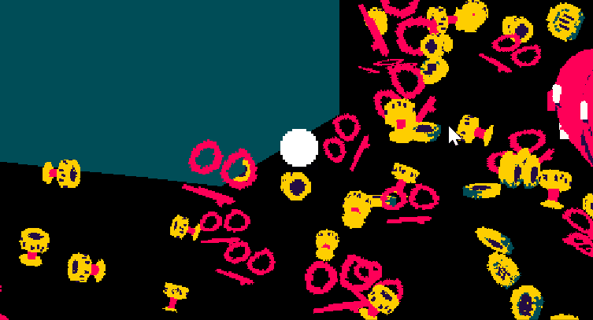

# Stack3D
The fastest method of Sprite Stacking in Gamemaker!

(As a benchmark, using this technique I can have 1500 sprite stacked models drawing at once at 60 fps. Using normal sprite stacking I can have about 200 at 60 fps.)

Stack3D is a small library for Gamemaker Studio 2 that lets you make Sprite-Stacking style games using actual 3d functionality. You can read how to use it here: https://dev-dwarf.github.io/dwarfdev/tutorials/2021/01/24/Stack3D-Guide.html

The demo project has everything you need to get started with using the system. Read the guide to figure out how to use it! If you have changes or improvements to suggest, feel free to make a pull request!

# MIT
Copyright 2021 Logan C Forman (dev_dwarf)

Permission is hereby granted, free of charge, to any person obtaining a copy of this software and associated documentation files (the "Software"), to deal in the Software without restriction, including without limitation the rights to use, copy, modify, merge, publish, distribute, sublicense, and/or sell copies of the Software, and to permit persons to whom the Software is furnished to do so, subject to the following conditions:

The above copyright notice and this permission notice shall be included in all copies or substantial portions of the Software.

THE SOFTWARE IS PROVIDED "AS IS", WITHOUT WARRANTY OF ANY KIND, EXPRESS OR IMPLIED, INCLUDING BUT NOT LIMITED TO THE WARRANTIES OF MERCHANTABILITY, FITNESS FOR A PARTICULAR PURPOSE AND NONINFRINGEMENT. IN NO EVENT SHALL THE AUTHORS OR COPYRIGHT HOLDERS BE LIABLE FOR ANY CLAIM, DAMAGES OR OTHER LIABILITY, WHETHER IN AN ACTION OF CONTRACT, TORT OR OTHERWISE, ARISING FROM, OUT OF OR IN CONNECTION WITH THE SOFTWARE OR THE USE OR OTHER DEALINGS IN THE SOFTWARE.
